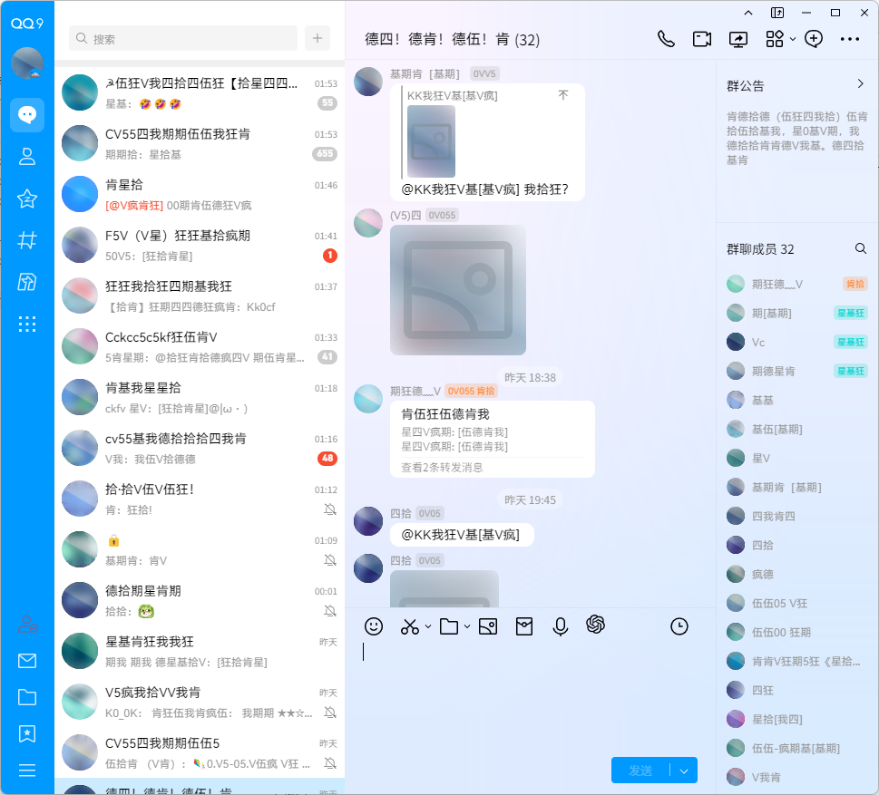

# ntqq_user_script
NTQQ 相关用户自定义脚本
- [LiteLoaderQQNT](https://github.com/LiteLoaderQQNT/LiteLoaderQQNT) 可以在 NTQQ 上加载插件
  - [LiteLoaderQQNT-CanCanNeed](https://github.com/MapleRecall/LiteLoaderQQNT-CCND/tree/main) 通过内容替换保护隐私，不影响布局和样式
  - [Transitio](https://github.com/PRO-2684/transitio) 用于加载 CSS 片段
  - [Scriptio](https://github.com/PRO-2684/Scriptio) 用于加载渲染层的 JavaScript 片段

## user css
### [admin-s-green-hat](https://raw.githubusercontent.com/sileence114/ntqq_user_script/refs/heads/main/css/admin-s-green-hat.css)
| 浅色模式 | 深色模式 |
| --- | --- |
|  |  |
> 让管理员戴回绿帽（将管理员头衔颜色重新改为绿色）
- 如果不喜欢我调的颜色，你可以在设置中自己调整
- 支持深色模式

### [less-spacing](https://raw.githubusercontent.com/sileence114/ntqq_user_script/refs/heads/main/css/less-spacing.css)
| 未启用 | 启用后 | 开启轻量工具箱的消息合并 | 引用与转发 |
| --- | --- | --- | --- |
|  |  |  |  |

> 减少元素间距
> （后续优化方向）尽量减少列表项的间距，让窗口显示更多内容。
- 已调整：
  - 消息列表
  - 转发消息窗口
  - 聊天区域
  - 适配轻量工具箱的合并消息模式 (v0.2.0 below)
  - 优化合并消息模式气泡圆角
  - 转发消息卡片
- 画饼：
  - 聊天记录窗口
  - 群相册之类的卡片
- 有点麻烦？（PR Please!）
  - 群聊窗口边栏成员列表（虚拟滚动区域列表元素数量有限，会露出空白的列表元素）
  - 其他犄角旮旯的地方
